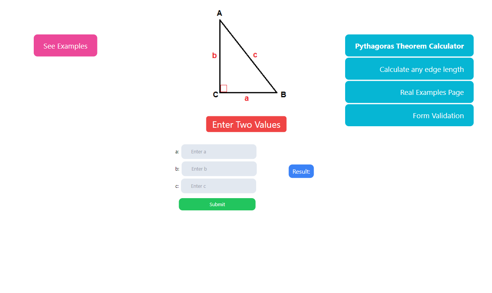
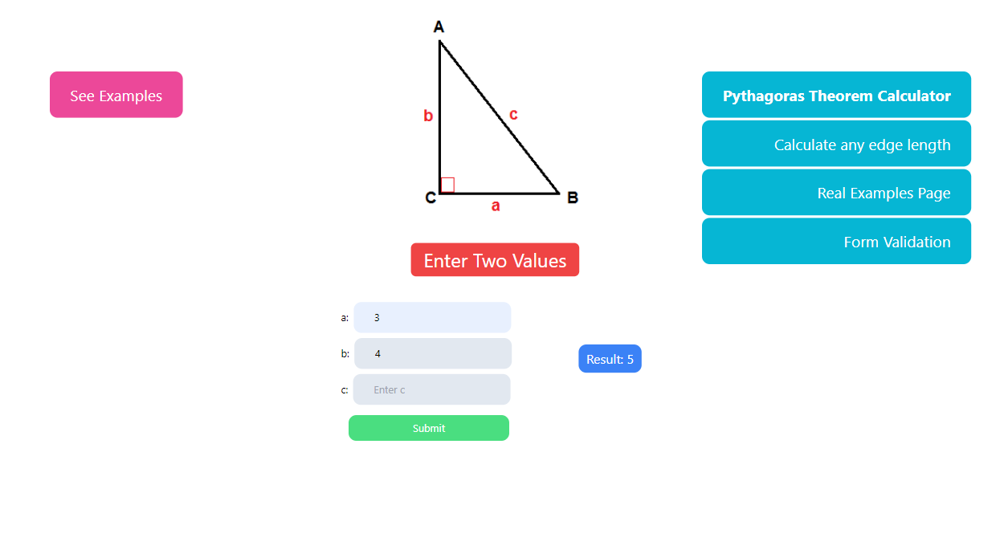
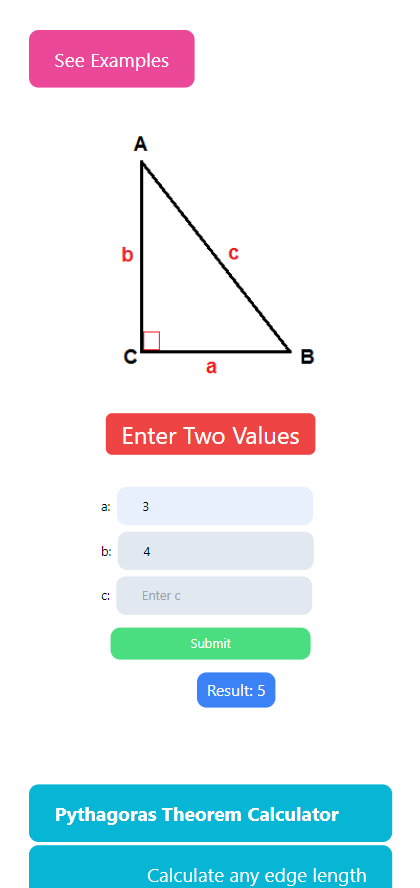
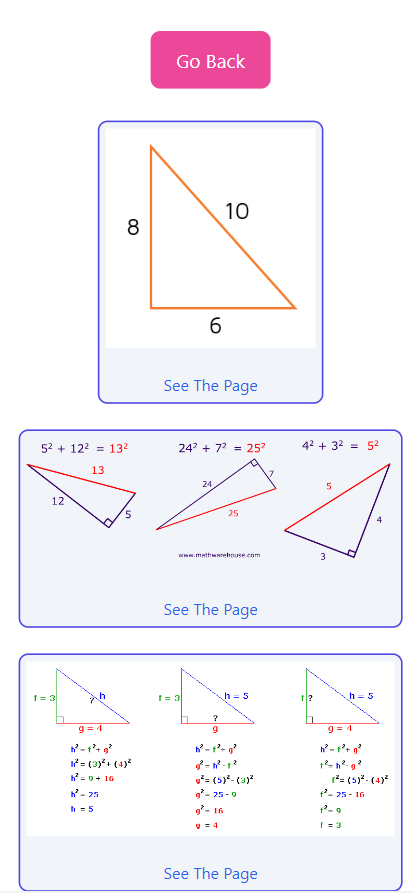

# Pythagoras Theorem Calculator 

simple React.Js calculator with responsive design.

## Learning Objectives

 - Responsive Desing
 - React Hooks
 - Tailwind CSS 

## Demo

https://pythagoras-theorem.vercel.app/

## App Preview

